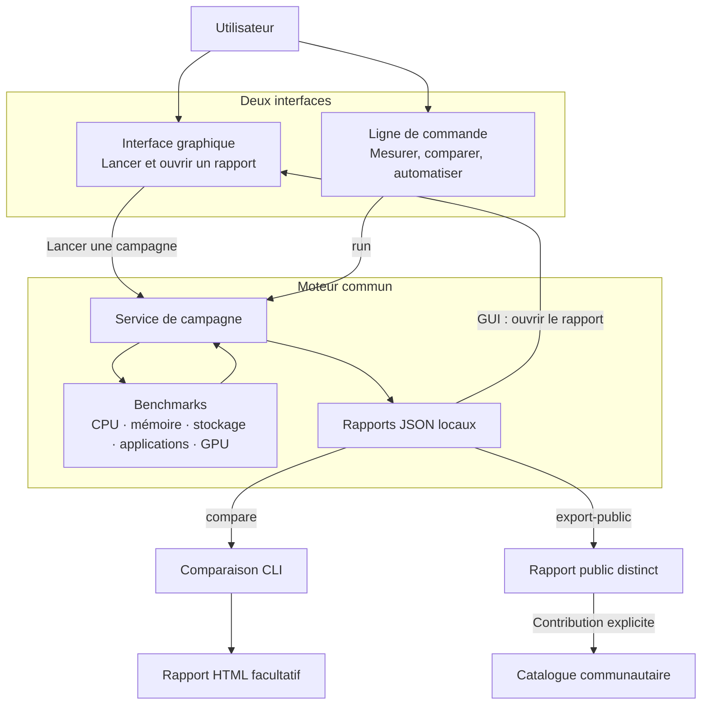
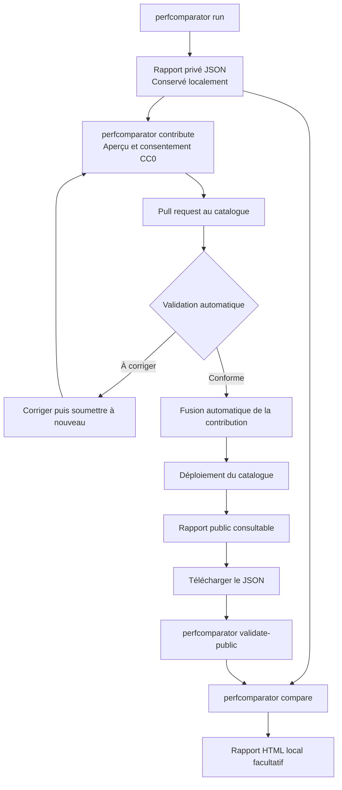

# PerfComparator

**Mesurez et comparez les performances de vos machines, avec les mêmes
scénarios sur macOS, Windows et Linux.**

PerfComparator permet de mesurer une machine selon une charge de travail et une
configuration données, puis de comparer les résultats entre plusieurs
machines. On peut aussi suivre l'évolution d'une même machine dans le temps ou
comparer différents systèmes installés dessus. Chaque campagne produit un
rapport JSON conservé localement.

PerfComparator fonctionne localement,
en interface graphique ou en ligne de commande, et conserve les résultats dans
des rapports JSON que vous pouvez comparer ou partager.

Stable : [`v0.5.0`](https://github.com/frchalaoux/perfcomparator/releases/tag/v0.5.0) ·
Préversion : [`v0.5.0.dev0`](https://github.com/frchalaoux/perfcomparator/releases/tag/v0.5.0.dev0) ·
[Toutes les versions](docs/versions.md) ·
[Tous les tags](https://github.com/frchalaoux/perfcomparator/tags)

Pour installer l'application graphique, ouvrez la
[page de téléchargement](https://frchalaoux.github.io/perfcomparator/) : elle
détecte votre système et propose l'archive adaptée. Python n'a pas besoin d'être
installé séparément.

## Deux façons d'utiliser la même application

PerfComparator a deux interfaces qui s'appuient sur le même moteur de mesure :

- **L'interface graphique** permet de choisir un profil, lancer une campagne et
  ouvrir son rapport sans mémoriser de commandes. Elle enregistre les rapports
  dans `Documents/PerfComparator`.
- **La ligne de commande** sert à lancer des mesures précises, comparer des
  rapports, automatiser des campagnes ou travailler sur un serveur sans bureau
  graphique. Par défaut, ses rapports sont enregistrés dans `data/results`.

Les deux modes produisent des rapports JSON compatibles. La CLI peut ensuite
les comparer et générer un rapport HTML. Un export public séparé est disponible
pour contribuer au catalogue ; aucune donnée n'est envoyée sans action
explicite.



## Démarrage rapide

### Lancer une mesure

Après installation, ouvrez PerfComparator depuis son icône ou son raccourci et
cliquez sur **Lancer la mesure**. En ligne de commande, une campagne standard
se lance ainsi :

```bash
perfcomparator run --label "Ma machine"
```

Les benchmarks couvrent le CPU, la mémoire, le stockage, des charges
d'applications et le GPU lorsqu'il est disponible. Les rapports JSON conservent
les mesures répétées et leur dispersion.

### Comparer des rapports

Une fois les rapports de plusieurs machines disponibles, comparer leurs
résultats et produire au besoin un rapport HTML :

```bash
perfcomparator compare premier-rapport.json second-rapport.json --html comparaison.html
```

Le premier rapport sert de référence. Les mesures doivent utiliser des versions
de protocole et des profils compatibles pour que la comparaison soit
pertinente. La CLI fonctionne aussi sur un serveur sans bureau graphique.
L'interface peut être ouverte depuis un terminal avec `perfcomparator desktop`.
`perfcomparator --help` liste les autres commandes.

## Publier, télécharger et comparer un rapport

Le rapport complet produit par une campagne reste privé sur votre machine. Pour
le partager, `perfcomparator contribute` prépare un export public distinct,
demande le consentement CC0 et propose une contribution au catalogue. Après
validation et publication, téléchargez le JSON public, puis comparez-le à vos
rapports locaux. La comparaison s'effectue localement ; elle ne publie rien.



Le catalogue contrôle le format et l'intégrité du rapport, pas l'identité de la
machine ni l'exactitude des performances déclarées. Voir le
[tutoriel de contribution et de comparaison](docs/tutoriel-catalogue.md) et le
[contrat du format public](docs/format-rapport-public.md).

## Documentation

### Installation et prise en main

| Besoin | Document |
| --- | --- |
| Installer sur macOS, Windows ou Linux, y compris sur un serveur | [Guide d'installation](docs/installation.md) |
| Utiliser l'interface ou la CLI, mesurer et comparer | [Guide utilisateur](docs/guide-utilisateur.md) |
| Désinstaller l'application et connaître les données conservées | [Guide de désinstallation](docs/desinstallation.md) |
| Choisir une version et retrouver son historique | [Versions disponibles](docs/versions.md) |

### Exécuter et comprendre les benchmarks

| Besoin | Document |
| --- | --- |
| Comprendre la reproductibilité et les limites des scores | [Méthodologie](docs/methodologie.md) |
| Connaître les tests réalisés et leurs références | [Références des benchmarks](docs/references-benchmarks.md) |

### Comparer des rapports

| Besoin | Document |
| --- | --- |
| Comparer des machines, interpréter les écarts et créer un rapport HTML | [Comparaison et rapport visuel](docs/guide-utilisateur.md#rapport-visuel-et-priorités) |

### Partager des résultats

| Besoin | Document |
| --- | --- |
| Préparer un rapport public et vérifier les données partagées | [Format des rapports publics](docs/format-rapport-public.md) |
| Contribuer au catalogue communautaire pas à pas | [Tutoriel du catalogue](docs/tutoriel-catalogue.md) |

### Développer, tester et publier

| Besoin | Document |
| --- | --- |
| Comprendre l'architecture, ajouter un benchmark et exécuter les tests locaux | [Guide développeur](docs/guide-developpeur.md) |
| Construire les installateurs, les tester sur les systèmes cibles et promouvoir les artefacts validés | [Stratégie de publication](docs/strategie-publication.md) |
| Exporter la documentation et ses diagrammes Mermaid en PDF | [Guide d'export PDF](docs/export-markdown-pdf.md) |

L'[index documentaire détaillé](DOCUMENTATION.md) rassemble également ces
ressources par thème.

## Tests et publication

Les contributions au code se vérifient localement avec les contrôles suivants :

```bash
uv sync
uv run ruff check .
uv run ruff format --check .
uv run pytest
uv build
```

La publication des installateurs suit un parcours distinct : fusion d'une PR
dans `main`, construction des artefacts avec leur SHA et manifeste, essais
automatiques puis installation manuelle sur les systèmes cibles, et enfin
promotion des mêmes fichiers testés vers la Release — sans reconstruction.
La [stratégie de publication](docs/strategie-publication.md) détaille les
contrôles et illustre les décisions par des schémas Mermaid.
