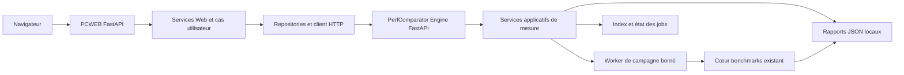

# Référence d’architecture PerfComparator, SMB et SMB-WEB

## Objet et statut

Ce document consigne l’état observé de PerfComparator et les motifs
d’architecture actuellement utilisés dans SMB et SMB-WEB. Il sert de base à la
révision du plan d’évolution Web ; il ne décrit pas une architecture déjà
implémentée. La topologie locale initiale est retenue ; les recommandations de
découpage des processus, dépôts et distributions sont consignées dans
`docs/propositions-decisions-phase-0.md`.

Le relevé a été effectué le 7 octobre 2026 à partir des index d’architecture,
des documents de contrat et des guides de développement, puis vérifié dans les
points d’entrée et modules actifs. Les documents de conception sont distingués
des comportements confirmés par le code.

## Résumé de l’écart architectural

PerfComparator possède aujourd’hui un paquet Python qui regroupe le moteur de
mesure, la CLI et l’interface de bureau. Le plan Web initial ajoutait un seul
serveur FastAPI à ce paquet. L’orientation retenue prévoit deux composants
applicatifs FastAPI inspirés de la séparation SMB et SMB-WEB : un service qui
exécute les mesures et une façade Web qui sert l’interface et appelle ce
service.

Pour le premier incrément, la topologie retenue est locale : PCE et PCWEB
seront installés sur la même machine, et PCE mesurera cette machine. La
séparation en deux processus et dépôts distincts est recommandée dans
`docs/propositions-decisions-phase-0.md`, sous réserve de vérification avant
implémentation. Un navigateur connecté à un déploiement distant ne peut pas
mesurer le processeur, le stockage ou le GPU de l’ordinateur qui l’utilise ;
un tel déploiement
mesurerait l’hôte serveur, sauf ajout ultérieur d’un agent local.

## PerfComparator aujourd’hui

### Paquet et interfaces

Le paquet `perfcomparator` contient actuellement :

- `benchmarks.py` et `gpu_benchmarks.py` pour les charges et le catalogue ;
- `service.py` pour exécuter une campagne et isoler les échecs ;
- `repository.py` pour lire et écrire les rapports JSON privés ;
- `comparison.py` et `html_report.py` pour analyser et présenter les
  comparaisons ;
- `public_report.py` pour créer et valider des rapports publics distincts ;
- `contribution.py` et `github_cli.py` pour le parcours de contribution ;
- `cli.py` pour l’interface Typer et `desktop.py` pour l’interface Tk.

La CLI et l’interface de bureau partagent le moteur. Les rapports privés sont
écrits localement sous forme de JSON, avec remplacement atomique du fichier.
Le dépôt `perfcomparator-results` est le registre public et le site du
catalogue ; il ne constitue pas un serveur applicatif PerfComparator.

Le projet exige actuellement Python `>=3.14,<3.15`. Ses dépendances runtime
n’incluent ni FastAPI ni Uvicorn. Aucun serveur HTTP PerfComparator n’est donc
présent dans l’état actuel du code.

### Exécution des campagnes

`BenchmarkService.run` exécute les runners successivement dans le processus qui
l’appelle. Le rappel `progress` permet de signaler les changements à son
appelant, mais il n’existe pas encore de registre de jobs, de file de travail,
de reprise après rafraîchissement du navigateur ou de protocole d’annulation.
Les répétitions sont agrégées par médiane et les échecs d’un benchmark
n’empêchent pas les suivants de s’exécuter.

Ce caractère synchrone convient aux interfaces actuelles. Une route `async`
FastAPI ne devra pas appeler directement une campagne longue sur sa boucle
d’événements : les mesures doivent être exécutées par un worker borné, avec un
état de tâche et une progression consultables séparément.

## Modèle utilisé par SMB

SMB est le backend API. Sa fabrique `create_app` reçoit éventuellement des
paramètres explicites, valide la configuration, prépare les ressources SQLite,
crée les tables au démarrage et les libère à l’arrêt. Les routeurs sont
assemblés dans un routeur de base.

Son organisation sépare plusieurs responsabilités :

- les routes FastAPI définissent le contrat HTTP et les codes de réponse ;
- les services orchestrent les cas d’usage ;
- les repositories isolent les accès SQLAlchemy ;
- les mappers et presenters adaptent les données d’entrée et de sortie ;
- les modules `business` portent les calculs métier et les politiques de
  sélection.

Les contrats de fitting sont versionnés, accompagnés de schémas JSON et
consommés par SMB-WEB. Les calculs longs de fitting disposent aussi d’un
protocole de jobs avec identifiants opaques, états consultables, résultats ou
erreurs structurés, annulation coopérative et persistance des états. La
documentation précise toutefois que le worker est local au processus API : ce
n’est pas une file durable qui rejoue les tâches après une panne.

Références principales dans le dépôt SMB :

- `sizemybike/__init__.py` : fabrique FastAPI et cycle de vie ;
- `sizemybike/apis/base.py` : assemblage des routes ;
- `sizemybike/core/config.py` : paramètres d’environnement ;
- `docs/Architecture/evolution/SMB Fitting User IO Contract v1.md` : contrat
  HTTP et jobs de calcul ;
- `docs/Architecture/evolution/SMB Biomechanics Angle Study v1 - API Layered
  Architecture and Reuse Guide.md` : responsabilités route/service/repository/
  mapper/presenter.

## Modèle utilisé par SMB-WEB

SMB-WEB est une façade FastAPI rendue côté serveur. Elle sert les pages HTML,
les templates Jinja et les fichiers statiques. Ses routes appellent des
services, lesquels composent des repositories de cookies et de requêtes vers
l’API SMB. Les services retournent des DTO typés ; les routes choisissent
ensuite le rendu ou la redirection.

Les appels backend sont conçus autour d’un client HTTP partagé, d’une
classification par intention (`READ`, `MUTATION`, `HEAVY`), d’une politique de
timeouts et d’une normalisation des erreurs. Le client est créé dans le
`lifespan` FastAPI et fermé à l’arrêt. Cookies de session et de préférence,
protection CSRF, cache, internationalisation et templates sont des
responsabilités propres à cette façade.

Références principales dans le dépôt SMB-WEB :

- `sizemybikeweb/app.py` : configuration de l’application, ressources
  partagées et montage statique ;
- `sizemybikeweb/webapps/base.py` : assemblage des routeurs Web ;
- `sizemybikeweb/web/services/` : orchestration et DTO ;
- `sizemybikeweb/web/repositories/` et `sizemybikeweb/http_client/` : accès
  backend et politique HTTP ;
- `docs/architecture/smb-web-architecture-audit.md` : carte générale des
  couches et règles ;
- `docs/architecture/service-layer.md` et
  `docs/architecture/http-repositories.md` : règles des services et
  repositories.

L’audit SMB-WEB décrit les règles visées ; le code doit rester la référence
pour confirmer leur application dans chaque module. Par exemple, un repository
Rider historique contient encore un client HTTP concret qui crée un
`httpx.AsyncClient` par requête et applique directement les timeouts. Il faut
donc vérifier la cohérence des implémentations avant d’en reprendre une comme
modèle unique.

## Motifs réutilisables

Pour PerfComparator, les motifs suivants sont directement pertinents :

- une fabrique d’application testable avec configuration injectée ;
- un `lifespan` pour démarrer et fermer proprement les ressources partagées ;
- des routeurs regroupés par domaine ;
- des frontières explicites entre routes, services, repositories et cœur
  métier ;
- des DTO de résultat stables et des erreurs applicatives normalisées ;
- un client HTTP unique côté façade, avec timeouts centralisés et tests par
  faux client ;
- des contrats API versionnés pour les campagnes, les tâches et les rapports ;
- des jobs observables et bornés pour les opérations longues ;
- des tests de routes via ASGI et des tests de services indépendants de
  FastAPI.

Il n’est pas nécessaire de reprendre les domaines SMB qui ne correspondent pas
au produit : comptes, utilisateurs, paiements, base relationnelle et modèle de
cookies d’authentification. Pour PerfComparator, les rapports JSON doivent
rester les archives de référence. SQLite peut indexer les rapports et conserver
l’état opérationnel des jobs, tant que ces données restent reconstructibles ou
que leur politique de sauvegarde est clairement définie.

### Structures de paquets comme modèles

La structure du backend SMB (`SMB/sizemybike/`) est le modèle pour PCE :
fabrique FastAPI, configuration, assemblage des routes, schémas, services,
repositories et modules métier. La structure SMB-WEB
(`SMB-WEB/sizemybikeweb/`) est le modèle pour PCWEB : fabrique FastAPI,
routeurs Web, services avec DTO, repositories HTTP, client SMB centralisé,
templates, fichiers statiques et middlewares.

Pour PerfComparator, le code de benchmarks et les règles de comparaison restent
dans le paquet PCE. PCWEB ne doit pas importer le cœur métier pour contourner
l’API locale : il appelle PCE par son client HTTP, comme SMB-WEB appelle SMB.
Le paquet racine `perfcomparator/` accueille maintenant le cœur existant et
les modules PCE, selon le modèle de `SMB/sizemybike/`. Le paquet PCWEB est
également placé à la racine de son dépôt sous `perfcomparatorweb/`, selon le
modèle de `SMB-WEB/sizemybikeweb/`.

## Topologie retenue pour le premier incrément

Les responsabilités suivent la séparation SMB/SMB-WEB, mais les deux services
FastAPI sont cohébergés localement :

PCE possède les capacités liées au matériel et aux fichiers de mesure :
inventaire, disponibilité, exécution, progression et accès contrôlé aux
rapports. PCWEB sert l’expérience utilisateur et orchestre les demandes au
moyen d’un client HTTP interne. Le navigateur communique avec PCWEB ; PCWEB
communique avec PCE. Les deux services restent liés à la boucle locale dans ce
premier mode. Les propositions de processus, paquetage et installation
conjointe figurent dans `docs/propositions-decisions-phase-0.md`.

Le plan existant prévoyait plusieurs éléments utiles — API sous `/api/v1`, SSE,
tâches longues, SQLite reconstructible et écoute locale par défaut — dans un
seul serveur. Il a maintenant été aligné sur cette topologie à deux services ;
le choix proposé est de lancer deux processus avec un orchestrateur local.
Références : `docs/plan-evolution-interface-web.md` et
`docs/propositions-decisions-phase-0.md`.

L’évolution vers des agents ne doit pas obliger à refaire le moteur : la phase 2
définira une demande de campagne sérialisable et une interface d’exécution,
implémentée uniquement par un worker local. Le protocole réseau,
l’enrôlement et la sécurité des agents restent hors du MVP et seront conçus si
un besoin distant est confirmé. Un serveur Gandi ne peut pas mesurer le poste
du navigateur : l’agent devra exécuter la mesure sur la machine cible puis
transmettre au serveur les données explicitement autorisées.

## Topologie et machine mesurée

| Déploiement | Machine effectivement mesurée | Conséquence |
| --- | --- | --- |
| **Premier incrément : PCWEB et PCE installés ensemble sur un ordinateur local** | **Cet ordinateur** | **Le navigateur ouvre PCWEB sur la boucle locale ; PCWEB appelle PCE sur la boucle locale.** |
| Web et Engine sur un serveur distant | Le serveur distant | Le navigateur de l’utilisateur ne transmet pas les capacités matérielles de son ordinateur. |
| Web distant et Engine local chez l’utilisateur | L’ordinateur de l’utilisateur | Il faut installer et sécuriser un agent local, puis établir un canal de communication adapté. |
| Plusieurs Engines sur plusieurs machines | Chaque hôte équipé d’un Engine | Il faut définir l’enregistrement des agents, l’authentification, les versions compatibles et les autorisations de lancement. |

Les deux dernières topologies dépassent la séparation locale PCWEB/PCE : un
serveur central ne peut pas ouvrir lui-même une connexion vers `localhost` du
navigateur. Leur sécurité et leur protocole nécessitent une décision dédiée
avant toute implémentation.

## Points de vigilance avant de reprendre les composants

### Versions Python et dépendances

PerfComparator exige Python `>=3.14,<3.15`. Les `pyproject.toml` SMB et
SMB-WEB déclarent `>=3.12,<3.14`, tandis que le README de SMB-WEB indique
encore Python `>=3.11`. Les versions des dépendances et les contraintes
d’installation doivent donc être établies pour PerfComparator ; copier les
fichiers de dépendances ne garantirait pas un environnement compatible.

### Fabriques et configuration

SMB expose `create_app(settings)` et facilite l’injection en test. SMB-WEB
utilise une fonction `start_application`, mais crée son application globale au
chargement du module et lit plusieurs paramètres globaux. Pour deux composants
PerfComparator, une fabrique avec paramètres injectés dans chacun des serveurs
est la base la plus prévisible pour les tests et les installations multiples.

### Travaux de mesure et jobs

Une tâche FastAPI qui attend directement un runner long bloque la réactivité
attendue du serveur. Le worker doit avoir une concurrence matérielle bornée,
un verrou contre les campagnes concurrentes, un état de tâche lisible après
rafraîchissement et des transitions définies après arrêt ou panne. L’annulation
doit respecter les limites des runners : elle peut être coopérative entre deux
benchmarks sans interrompre arbitrairement chaque opération native.

### Client HTTP et contrats

Si le composant Web appelle l’Engine, le client HTTP, ses timeouts, son
authentification, la classification des appels et le format des erreurs doivent
être centralisés. Les identifiants de jobs et de rapports devraient être
opaques ; les requêtes de campagne et les réponses devraient avoir des schémas
versionnés, sans exposer de chemins locaux arbitraires.

### Données et sécurité

Les rapports privés ne doivent pas quitter l’Engine sans action explicite. Le
mode local doit écouter uniquement sur la boucle locale par défaut. Un mode
réseau doit spécifier son authentification, ses contrôles d’origine, sa
protection CSRF côté navigateur, ses quotas et ses sauvegardes. Les opérations
de publication au catalogue restent distinctes des opérations locales et
requièrent une confirmation explicite.

## Décisions de cadrage proposées

Les recommandations actuelles sont regroupées dans
`docs/propositions-decisions-phase-0.md` : deux processus FastAPI, dépôts et
distributions séparés pour PCE et PCWEB, API PCE versionnée, worker local et
authentification par secret éphémère sur boucle locale. Ces choix sont des
propositions de planification et ne signifient pas que les composants ou le
dépôt PCWEB existent déjà.

## Prochaine étape proposée

Confirmer les décisions de phase 0, puis réaliser les vérifications de
compatibilité Python, FastAPI et installateurs avant l’implémentation. Le
déploiement d’agents distants reste hors du premier incrément.
