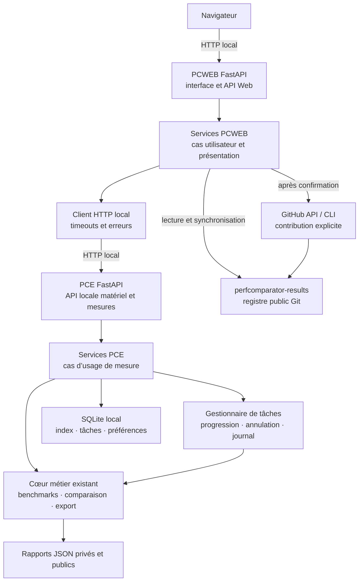

# Plan d’évolution vers PerfComparator Engine et PerfComparator Web

## Statut et portée

Ce document décrit l’évolution envisagée de PerfComparator vers deux
composants FastAPI locaux : **PerfComparator Engine (PCE)**, qui accède au
matériel et exécute les mesures, et **PerfComparator Web (PCWEB)**, qui sert
l’interface navigateur et appelle PCE. La CLI reste une interface prise en
charge par le même cœur métier. Ce document constitue un plan de réalisation ;
il ne décrit pas une fonctionnalité déjà disponible.

Le premier socle de code est maintenant présent dans les deux dépôts locaux :
chaque service expose son état de santé, PCWEB le consulte par HTTP authentifié,
et les commandes de gestion lancent ou arrêtent les processus. La page Web est
encore un diagnostic de connexion ; les parcours de mesure, d’historique et de
rapport restent à implémenter dans les phases 1 et 2.

Le premier incrément installe et lance PCE et PCWEB sur la machine à mesurer.
Les deux services n’écoutent que sur la boucle locale. Le navigateur parle à
PCWEB, et PCWEB appelle PCE par HTTP local. Les choix recommandés pour les
processus, dépôts et distributions sont détaillés dans les
[propositions de décisions de phase 0](propositions-decisions-phase-0.md). Les
noms ont été confirmés et le dépôt PCWEB public a été créé ; son code sera
publié après revue et confirmation explicite.

Les évolutions ultérieures pourront fonctionner :

- localement, sur la machine mesurée, avec accès aux rapports privés et au
  moteur de benchmark ;
- sur un serveur administré, pour mesurer cette machine serveur et gérer ses
  rapports ;
- sans rendre obligatoire un service central pour consulter le catalogue
  public.

Un navigateur connecté à un serveur distant ne peut pas mesurer directement le
CPU, le stockage ou le GPU de la machine du visiteur. Une mesure distante de
plusieurs machines nécessiterait ultérieurement un agent installé sur chacune
d’elles ; ce cas n’appartient pas au premier périmètre.

Pour éviter une réécriture si ce besoin se confirme, le premier incrément
définira dès maintenant une frontière stable entre la demande de campagne et
son exécution. Il n’inclura que l’exécuteur local. L’enrôlement des agents,
leurs connexions réseau, leur authentification distante, les mises à jour et
leur supervision seront développés plus tard, lorsque les besoins seront
confirmés.

## Proposition de découpage des dépôts

Le plan sépare le backend PCE et la façade PCWEB comme SMB et SMB-WEB, sans
copier les domaines métier ni dupliquer le cœur. L’utilisateur a confirmé le
nom `perfcomparator-web` pour le dépôt PCWEB et `perfcomparatorweb` pour son
paquet installable et import Python. Le dépôt distant public est créé ; le
push de son code nécessitera une confirmation distincte.

| Dépôt | Responsabilité durable |
| --- | --- |
| `perfcomparator` (existant) | Cœur métier, CLI, PCE et stockage des rapports locaux. |
| `perfcomparator-web` (public, créé) | PCWEB : interface navigateur, services de présentation et client HTTP PCE. |
| `perfcomparator-results` (existant) | Registre des rapports publics, validation CI, revue des contributions et site statique public. |

PCE garde sa distribution existante `perfcomparator` et utilise désormais le
module Python `perfcomparator`, installé depuis le dossier racine du même nom.
PCWEB utilise la distribution et le module Python confirmés
`perfcomparatorweb`. Les deux composants seront installés ensemble dans le
parcours utilisateur local et communiqueront uniquement par HTTP versionné.

## Modèle de structure des composants

La structure Python de SMB et SMB-WEB sert de modèle pour séparer les deux
applications : le paquet `sizemybike/` est le modèle du backend PCE, et
`sizemybikeweb/` est le modèle de la façade PCWEB. On reprend leurs frontières
de modules, leurs fabriques FastAPI et leurs conventions de services et
repositories ; on ne copie ni leurs domaines métier ni leurs implémentations
propres à SizeMyBike.

| Composant | Modèle de structure | Modules PerfComparator attendus |
| --- | --- | --- |
| PCE | `SMB/sizemybike/` | `app`, `core/config`, `apis/base` et routes, `schemas`, services d’orchestration, `executors/base` et `executors/local`, cœur `business`, repositories pour les rapports et l’état des jobs. |
| PCWEB | `SMB-WEB/sizemybikeweb/` | `app`, `core/config`, `webapps/base` et routes, `web/services`, `web/repositories`, `http_client`, `templates`, `static`, middlewares. |

Le code de benchmark, de comparaison et de rapport reste dans PCE. PCWEB appelle
ses contrats par HTTP et ne réimplémente pas ces fonctions. Le paquet racine
`perfcomparator/` accueille le cœur existant et les nouveaux modules PCE,
comme `SMB/sizemybike/`. Le paquet racine `perfcomparatorweb/` reprend
`SMB-WEB/sizemybikeweb/`.

Le socle PCE place maintenant la fabrique dans `perfcomparator/app.py`, les
routes dans `perfcomparator/apis/`, la configuration et le gestionnaire de
processus dans `perfcomparator/core/`, et l’entrée Uvicorn dans
`perfcomparator/server.py`. Le dossier d’empaquetage `src/` n’est pas utilisé.
Les modules historiques de benchmarks restent au niveau racine car CLI, bureau
et PCE partagent le même moteur ; l’ajout des campagnes devra introduire les
frontières `business`, `schemas`, `services` et `repositories` pour les nouveaux
contrats et l’orchestration, sans dupliquer ce moteur.

Le dépôt `perfcomparator-results` ne change que lorsqu’une évolution du contrat
public, du catalogue ou du parcours de contribution l’exige. Le contrat
OpenAPI PCE sera la référence de compatibilité du client PCWEB.

Un dépôt supplémentaire pour un orchestrateur central ne deviendra justifié
que si le service multi-utilisateur possède son propre cycle de publication,
son équipe ou ses contraintes d’exploitation. Il devra dépendre du contrat PCE
au lieu de recopier le cœur PerfComparator.

## Principes directeurs

1. Le moteur Python reste la source de vérité. Le Web et la CLI appellent les
   mêmes services et ne réimplémentent pas les règles métier.
2. La CLI reste stable et automatisable. L’interface Web est une façade
   supplémentaire, pas son remplacement interne.
3. Un rapport privé ne quitte jamais la machine sans une action explicite.
4. Toute opération distante est annoncée et confirmée au dernier moment.
5. Le premier mode démarre PCE et PCWEB sur la même machine, liés à la boucle
   locale ; le navigateur n’accède qu’à PCWEB.
6. Tout mode réseau ultérieur est fermé par défaut : écouter sur une interface
   réseau doit être une décision explicite et protégée.
7. Les tâches longues sont observables, annulables lorsque cela est sûr et
   récupérables après un rafraîchissement du navigateur.
8. Le catalogue Git reste la source de vérité publique. Une base applicative
   peut en conserver un index reconstructible.
9. Les formats, protocoles et migrations restent versionnés et testés.
10. Le premier incrément privilégie un déploiement local mono-utilisateur avant
   toute fonction multi-utilisateur.

## Architecture cible



### Couches logicielles

#### Cœur métier

Les modules actuels restent indépendants du transport HTTP :

- `benchmarks.py` et `gpu_benchmarks.py` définissent les charges ;
- `service.py` orchestre une campagne ;
- `repository.py` charge et sauvegarde les rapports ;
- `comparison.py` analyse les rapports ;
- `html_report.py` produit le document autonome ;
- `public_report.py` exporte et valide les données publiques ;
- `contribution.py` prépare les opérations GitHub.

Les fonctions encore couplées à `typer`, aux questions interactives ou à
l’affichage terminal devront être extraites vers des services retournant des
objets structurés. La CLI convertira ensuite ces objets en texte ; l’API les
convertira en JSON.

#### Services applicatifs

Cette couche exprime les cas d’usage complets :

- inventorier la machine et vérifier sa disponibilité ;
- résoudre une sélection de benchmarks ;
- lancer et suivre une campagne ;
- indexer, consulter et retirer un rapport ;
- vérifier la compatibilité et comparer des rapports ;
- préparer un export public et présenter son aperçu ;
- valider le consentement CC0 ;
- préparer puis soumettre une contribution.

Chaque service reçoit explicitement ses répertoires, sa politique de sécurité
et ses dépendances externes. Aucun chemin global implicite ne doit être enfoui
dans une route HTTP.

#### PCE et API de mesure

PCE héberge les capacités qui doivent s’exécuter sur la machine mesurée :

- accès aux informations matérielles et aux contrôles de disponibilité ;
- lancement et suivi des campagnes via un worker borné ;
- accès contrôlé aux rapports JSON et à l’index local ;
- maintien des résultats privés sur la machine locale.

PCE ne sert pas directement les pages navigateur. Il écoute sur la boucle
locale dans le premier incrément et refuse par défaut toute exposition réseau.

PCE expose aussi :

- une API JSON versionnée, par exemple sous `/api/v1` ;
- un flux d’événements pour la progression des tâches ;
- une vérification d’état sous `/health` ne révélant aucune donnée privée.

FastAPI est retenu pour PCE et PCWEB. Le cœur métier et les services de mesure
ne doivent pas dépendre de FastAPI ; les couches HTTP adaptent leurs contrats
aux services applicatifs.

#### PCWEB et interface navigateur

PCWEB fournit les ressources HTML, CSS et JavaScript embarquées dans le paquet,
les routes Web et les fonctions de présentation. Ses services utilisent un
repository HTTP pour appeler PCE ; aucune route ne crée son propre client HTTP.

Le client PCWEB → PCE centralise les timeouts, l’authentification locale, la
classification des appels et la traduction des erreurs. Le navigateur
communique uniquement avec PCWEB.

Le premier mode doit fonctionner hors ligne pour les ressources de l’interface.

Une application JavaScript légère suffit initialement. Elle doit rester
utilisable au clavier, offrir des libellés explicites et éviter de dépendre
d’un CDN. Toutes ses ressources sont servies par PCWEB.

## Modes d’exécution

### Mode local

Commandes cibles :

```bash
perfcomparator web start
perfcomparator web stop
perfcomparator web status
perfcomparator engine start
perfcomparator engine stop
perfcomparator engine status
perfcomparatorweb start
perfcomparatorweb stop
perfcomparatorweb status
```

`perfcomparator web start` lance PCE puis PCWEB en arrière-plan, vérifie leur
disponibilité, puis ouvre l’interface servie par PCWEB. `perfcomparator web`
sans sous-commande est son raccourci. `perfcomparator web stop` arrête PCWEB
puis PCE ; `status` affiche l’état des deux. Les commandes `engine` et
`perfcomparatorweb` gèrent chaque composant séparément. Le lancement de PCWEB
seul requiert l’URL PCE et son secret local.

Les commandes distinctes ci-dessus permettent aussi de démarrer et d’arrêter
PCE ou PCWEB individuellement, notamment pour le développement et le
diagnostic. Les commandes de contrôle doivent demander une fermeture ASGI
ordonnée au moyen d’un canal privé lié à la boucle locale ; les PID, ports et
secrets sont stockés dans le répertoire d’état utilisateur, hors des rapports.
`engine stop` refuse par défaut si PCWEB est encore actif ; l’arrêt groupé gère
l’ordre.

Comportement par défaut :

- PCWEB et PCE écoutent exclusivement sur `127.0.0.1` et `::1` ;
- chaque serveur utilise un port disponible, avec une configuration qui permet
  à PCWEB de résoudre l’URL locale de PCE ;
- ouverture facultative du navigateur ;
- jeton de session aléatoire lorsque nécessaire ;
- répertoire de données utilisateur résolu par la plateforme ;
- PCE mesure la machine locale ;
- aucune télémétrie et aucun envoi automatique.

La commande historique `perfcomparator desktop` pourra lancer ces deux
services puis ouvrir PCWEB dans le navigateur. Elle devra rester comme alias
de compatibilité pendant au moins une version stable avant toute décision de
retrait.

### Mode serveur mono-utilisateur

Commande cible indicative :

```bash
perfcomparator web --host 127.0.0.1 --no-open-browser
```

Dans ce mode ultérieur, PCWEB peut être exposé derrière un reverse proxy HTTPS
administré, tandis que PCE reste accessible uniquement depuis le même hôte.
PCE mesure alors le serveur. Cette première version serveur vise un
utilisateur ou une petite instance de confiance. Elle doit documenter :

- le compte système dédié ;
- le répertoire persistant ;
- le reverse proxy et TLS ;
- la méthode d’authentification ;
- les sauvegardes ;
- les limites CPU, mémoire, espace disque et durée ;
- les mises à jour et le retour arrière.

Écouter directement sur `0.0.0.0` sans authentification doit être refusé, ou au
minimum exiger une option d’acceptation explicite accompagnée d’un avertissement
fort. L’application ne doit pas inventer un mécanisme TLS artisanal.

### Mode multi-utilisateur futur

Ce mode n’est pas une simple option de lancement. Il implique :

- comptes, sessions, rôles et récupération d’accès ;
- séparation stricte des rapports privés par propriétaire ;
- quotas et ordonnancement équitable ;
- audit des actions ;
- politique de conservation et d’effacement ;
- PostgreSQL ou stockage transactionnel équivalent ;
- workers isolés et éventuellement agents distants ;
- protection contre les abus et supervision opérationnelle.

Une décision d’architecture séparée sera nécessaire avant de commencer ce
mode.

### Évolution avec agents de mesure

Un serveur central, y compris hébergé chez Gandi, mesure uniquement sa propre
machine. Pour mesurer d’autres ordinateurs, chacun doit exécuter localement un
agent qui lance le moteur PerfComparator et transmet au serveur l’état de la
campagne ainsi que les résultats autorisés. Le navigateur seul ne peut pas
fournir les capacités matérielles de son poste.

Le premier incrément prépare cette évolution avec une demande de campagne
sérialisable et une frontière d’exécution, mais ne livre qu’un worker local.
L’agent, son enrôlement et sa révocation, son authentification distante, les
reconnexions, la compatibilité des versions et les règles de transfert et de
rétention des données sont reportés à la phase 8 et soumis à une étude de
besoin. La forme exacte du composant exécuté sur chaque machine reste à décider
à cette phase.

Détails : [référence d’architecture PerfComparator, SMB et SMB-WEB](architecture-perfcomparator-smb-reference.md)
et [détail des phases 1 et 2](plan-phases-1-2.md).

## Couverture fonctionnelle du CLI

| Commande actuelle | Écran ou action Web | Traitement partagé attendu |
| --- | --- | --- |
| `info` | Tableau de bord matériel | `system_snapshot`, adaptateurs GPU et diagnostic structuré. |
| `list` | Catalogue filtrable des benchmarks | Définitions, groupes et profils du cœur. |
| `describe` | Fiche détaillée d’un benchmark | Méthode, limites et références existantes. |
| `run` | Assistant de campagne | Résolution, préparation, progression et sauvegarde communes. |
| `history` | Bibliothèque des rapports | Dépôt JSON et index local. |
| `compare` | Sélection, référence, pondérations et rapport | `analyze_reports` et `render_html`. |
| `export-public` | Aperçu et export public | `export_public_report` et `save_public_report`. |
| `validate-public` | Import ou validation d’un fichier | `load_public_report`. |
| `setup-contribution` | Diagnostic des prérequis | Service GitHub sans interaction terminal. |
| `contribute` | Parcours relu et confirmé étape par étape | Export, consentement, authentification et soumission partagés. |
| `desktop` | Lanceur de l’interface Web locale | Démarrage du serveur et ouverture du navigateur. |

Les options expertes de la CLI restent disponibles. Une option Web ne doit pas
être ajoutée si elle ne peut pas être expliquée, validée et représentée sans
ambiguïté.

## Parcours et navigation

### Tableau de bord

Le tableau de bord présente :

- version de PerfComparator et version du protocole ;
- système, processeur, mémoire et GPU ;
- emplacement des rapports ;
- dernière campagne et dernier échec ;
- état ponctuel avant mesure ;
- raccourcis vers une nouvelle campagne, l’historique et la comparaison.

Les informations coûteuses ou susceptibles d’échouer, notamment WebGPU, sont
chargées séparément pour ne pas bloquer toute la page.

### Nouvelle campagne

L’assistant suit un ordre déterministe :

1. choisir un profil ou une sélection avancée ;
2. choisir les groupes ou benchmarks ;
3. choisir le disque de travail et, si nécessaire, le GPU ;
4. nommer la configuration ;
5. exécuter le contrôle préalable ;
6. afficher les avertissements sans masquer leurs conséquences ;
7. confirmer le lancement ;
8. suivre chaque benchmark et chaque répétition ;
9. présenter le rapport, les échecs partiels et les actions suivantes.

Un rafraîchissement ne doit pas lancer une seconde campagne. L’interface se
rattache à l’identifiant de tâche existant.

### Bibliothèque des rapports

Elle offre recherche, tri, pagination, aperçu et sélection multiple. Les
actions sont séparées selon leur portée :

- ouvrir ou télécharger le JSON privé ;
- comparer ;
- exporter une copie publique ;
- supprimer localement après confirmation ;
- restaurer depuis une sauvegarde si une politique de corbeille est retenue.

Le nom du fichier ne constitue pas seul l’identité d’un rapport. L’index doit
conserver le chemin canonique, les versions, la date, le profil et une empreinte
du contenu.

### Comparaison

Le parcours permet de choisir au moins deux rapports, désigner la référence,
ajuster les scénarios et générer l’analyse. Le serveur utilise exclusivement le
moteur Python afin d’éviter une divergence entre la CLI et le navigateur.

Les refus doivent expliquer précisément la différence : protocole, profil,
environnement Python, benchmark absent, unité ou paramètres incompatibles. Une
différence de schéma source ne suffit pas à refuser deux rapports publics dont
le protocole et les mesures sont compatibles.

### Export et contribution publique

L’interface affiche côte à côte :

- les données privées qui restent locales ;
- les champs exacts du futur rapport public ;
- le nom commercial et la référence publique proposés ;
- la licence CC0 ;
- l’identifiant de contenu final.

Le consentement à l’export ne vaut pas consentement à l’envoi. La soumission
GitHub demande une seconde confirmation indiquant le dépôt, la branche créée et
la pull request cible. Les erreurs d’authentification ou de réseau ne doivent
jamais supprimer l’export local préparé.

## API applicative indicative

Cette liste sert à découper les responsabilités ; les chemins définitifs seront
figés après le prototype. Dans le premier incrément, les routes `/api/v1` qui
touchent au matériel, aux campagnes, aux jobs et aux rapports appartiennent à
PCE. PCWEB appelle ce contrat côté serveur ; le navigateur ne contacte pas
directement PCE. Les routes de présentation et de session restent dans PCWEB.

| Méthode et chemin | Usage | Effet |
| --- | --- | --- |
| `GET /api/v1/system` | Inventaire matériel | Lecture seule. |
| `POST /api/v1/readiness` | Contrôle avant mesure | Échantillonnage local court. |
| `GET /api/v1/benchmarks` | Catalogue, groupes et profils | Lecture seule. |
| `GET /api/v1/benchmarks/{id}` | Documentation détaillée | Lecture seule. |
| `POST /api/v1/runs` | Créer une campagne | Tâche longue et écriture d’un rapport. |
| `GET /api/v1/jobs/{id}` | État et résultats | Lecture de tâche. |
| `GET /api/v1/jobs/{id}/events` | Progression | Flux SSE initialement. |
| `POST /api/v1/jobs/{id}/cancel` | Demander l’arrêt | Annulation coopérative. |
| `GET /api/v1/reports` | Historique paginé | Lecture de l’index. |
| `GET /api/v1/reports/{id}` | Métadonnées ou contenu autorisé | Lecture contrôlée. |
| `DELETE /api/v1/reports/{id}` | Retrait local | Destructif, confirmation requise. |
| `POST /api/v1/comparisons` | Analyse de rapports | Calcul local, éventuellement asynchrone. |
| `POST /api/v1/public-exports` | Préparer un export | Création locale après consentement. |
| `POST /api/v1/public-validations` | Valider un fichier public | Lecture et diagnostic. |
| `POST /api/v1/contributions` | Soumettre un export | Écriture distante explicitement confirmée. |
| `GET /api/v1/catalog` | Parcourir le catalogue public | Cache reconstructible. |

Les requêtes de mutation utilisent un identifiant d’idempotence. Les erreurs
répondent avec un code stable, un message utilisateur et des détails de champ,
sans trace Python ni chemin privé non nécessaire.

## Exécution des tâches longues

Une campagne ne doit pas s’exécuter dans la requête HTTP :

1. l’API valide les paramètres et crée une tâche ;
2. un worker local unique la prend en charge ;
3. les événements de progression sont persistés avec une taille bornée ;
4. le navigateur reçoit les changements via SSE ;
5. le rapport est écrit atomiquement ;
6. l’état terminal référence le rapport ou l’erreur structurée.

La première version n’autorise qu’une campagne matérielle à la fois. Les
comparaisons et lectures peuvent continuer en parallèle. Le lancement concurrent
retourne un état occupé clair plutôt que de dégrader silencieusement les scores.

### Frontière d’exécution préparée pour les agents

Dès la phase 2, une campagne est représentée par une demande JSON sérialisable
et validée, indépendante du lieu où elle s’exécute. L’orchestrateur de tâches
dépend d’une interface `BenchmarkExecutor` étroite ; sa première implémentation
est `LocalBenchmarkExecutor`. Les états, événements, résultats, erreurs
structurées et annulations coopératives ont des contrats stables. La demande
métier ne contient ni chemin arbitraire, ni commande shell, ni identité d’agent.

Cette frontière permet de remplacer ou compléter ultérieurement le worker local
par un adaptateur vers un agent. En mode local, l’orchestrateur choisit
implicitement le worker local ; un futur mode central pourra ajouter un
`target_id` au routage sans contaminer la demande de mesure. Si l’utilisateur
doit sélectionner une machine, l’API et l’interface pourront évoluer pour ce
choix distinct. Le rapport privé complet ne sera pas transféré tel quel : un
DTO distant explicite devra préserver les résultats utiles et filtrer chemins
et données de processus. Cela ne constitue pas dès maintenant un protocole
réseau d’agent :
on ne construit ni enrôlement, ni identité distante, ni reprise des connexions,
ni distribution de mises à jour. Ces éléments nécessitent une conception de
sécurité et d’exploitation dédiée.

Dans un déploiement centralisé, par exemple sur un serveur Gandi, le serveur
peut gérer les campagnes et les résultats, mais il ne mesure pas le poste
utilisateur par le simple fait que le navigateur s’y connecte. Un agent installé
sur chaque machine cible devra exécuter localement le moteur, puis transmettre
au serveur les résultats et événements autorisés par la politique de données.
Les rapports privés ne sont donc pas envoyés par défaut ; le protocole devra
distinguer les métadonnées de tâche, les mesures et les éventuels rapports
exportables.

L’annulation est coopérative entre deux unités de travail. Un benchmark déjà en
cours termine ou interrompt ses ressources selon les garanties de son runner.
Après un arrêt brutal, les tâches `running` deviennent `interrupted` au prochain
démarrage ; elles ne sont jamais relancées automatiquement.

## Données et stockage

### Rapports JSON

Les JSON restent le format d’échange et l’archive de référence. Ils sont écrits
de manière atomique et peuvent être relus sans base de données. Les rapports
privés et publics résident dans des répertoires distincts.

### SQLite

SQLite est recommandé pour le mode local et mono-utilisateur. Il stocke des
données reconstructibles ou opérationnelles :

- index des rapports et empreintes ;
- tâches, progression et erreurs ;
- préférences non sensibles ;
- état de synchronisation du catalogue ;
- confirmations techniques nécessaires à l’idempotence.

Les secrets GitHub, mots de passe ou clés TLS n’y sont pas conservés en clair.
Le trousseau du système ou la configuration du reverse proxy prend en charge
les secrets.

Tables indicatives :

- `reports(id, path, kind, content_hash, schema_version, protocol_version,
  profile, recorded_at, indexed_at)` ;
- `jobs(id, kind, state, created_at, started_at, finished_at, parameters_json,
  result_ref, error_code)` ;
- `job_events(job_id, sequence, occurred_at, level, payload_json)` ;
- `settings(key, value_json, updated_at)` ;
- `catalog_sync(source_revision, fetched_at, status)`.

Chaque migration possède un numéro, une transaction, un test depuis la version
précédente et une stratégie de sauvegarde. Une base absente peut être recréée en
réindexant les rapports ; la perte de la base ne doit pas détruire les JSON.

### Catalogue public

`perfcomparator-results` demeure la source de vérité publique. L’application
peut télécharger son index généré, mettre en cache les métadonnées et récupérer
un rapport à la demande. Le cache doit être supprimable et reconstructible.

Une base publique centrale ne sera envisagée que lorsque des besoins mesurés le
justifieront : volume important, comptes, mutations fréquentes, requêtes
complexes, modération intégrée ou agents multiples. Une décision future devra
comparer explicitement Git, SQLite, PostgreSQL et stockage objet, ainsi que leur
coût de migration et d’exploitation.

## Sécurité

### Frontière de confiance

Le navigateur n’est jamais considéré comme fiable, même sur `localhost`.
L’API valide types, bornes, identifiants et transitions d’état. Un identifiant
de rapport est résolu côté serveur ; le client ne fournit pas un chemin libre à
lire ou supprimer.

### Protections minimales

- écoute en boucle locale par défaut ;
- vérification stricte de `Host` et `Origin` ;
- cookies `HttpOnly`, `SameSite` et `Secure` sous HTTPS ;
- protection CSRF de toutes les mutations ;
- politique CSP sans scripts distants ni `unsafe-eval` ;
- limites de taille JSON et de durée ;
- chemins canoniques contenus dans les racines autorisées ;
- refus des liens symboliques lors d’une suppression ;
- échappement systématique des textes dans les rapports HTML ;
- absence d’exécution de commandes arbitraires ;
- journalisation sans contenu privé ni jeton ;
- confirmations séparées pour suppression, export CC0 et publication.

### Authentification serveur

Le mode distant ne peut pas se contenter du caractère aléatoire du port. La
première cible recommande une authentification déléguée au reverse proxy ou un
jeton administrateur robuste. Toute solution intégrée devra couvrir rotation,
expiration, limitation des tentatives et révocation avant d’être annoncée comme
sûre pour Internet.

### Exécution des benchmarks

Les paramètres restent dans une liste blanche. Le répertoire de travail est
sélectionné parmi des racines configurées. Les tailles, répétitions et durées
sont bornées par les profils et par une politique serveur. Aucun argument ne
doit être concaténé dans une commande shell.

## Configuration

Ordre de priorité proposé : options de commande, variables d’environnement
documentées, fichier de configuration utilisateur, valeurs sûres par défaut.
Chaque valeur doit avoir une représentation unique et observable dans une page
d’administration en lecture seule.

Configuration minimale :

- adresse et port d’écoute ;
- ouverture automatique du navigateur ;
- répertoires privés, publics, temporaires et de base ;
- racines de travail autorisées ;
- URL du catalogue et délai de cache ;
- nombre de tâches simultanées ;
- niveau de journalisation ;
- mode local ou serveur ;
- en-têtes de proxy explicitement approuvés.

## Observabilité et exploitation

Les journaux structurés contiennent l’identifiant de requête et de tâche, mais
pas les résultats complets, chemins privés, cookies ou jetons. Les événements
essentiels sont : démarrage, arrêt, migration, campagne, export, suppression,
synchronisation et contribution.

Les vérifications d’état distinguent :

- processus vivant ;
- base accessible ;
- répertoires accessibles ;
- worker disponible ;
- catalogue distant éventuellement joignable.

La panne du catalogue ne doit pas empêcher les benchmarks locaux. Une panne de
base ne doit jamais déclencher sa suppression automatique. Les sauvegardes
incluent la base et les rapports, avec une procédure de restauration testée.

## Tests et qualité

### Tests unitaires

- cas d’usage indépendants du serveur HTTP ;
- validation des paramètres et autorisations ;
- transitions de tâches ;
- indexation et migrations SQLite ;
- calculs identiques entre CLI et Web ;
- sérialisation stable des erreurs.

### Tests d’intégration

- API avec répertoires temporaires ;
- démarrage et arrêt du worker ;
- progression SSE et reconnexion ;
- sauvegarde atomique et reprise après interruption ;
- export public sans réseau ;
- contribution simulée sans écriture GitHub réelle ;
- refus des chemins hors racine, liens symboliques et origines étrangères.

### Tests de bout en bout

- parcours au clavier dans les navigateurs supportés ;
- lancement d’un benchmark court simulé ;
- rafraîchissement pendant une tâche ;
- comparaison et téléchargement HTML ;
- suppression confirmée ;
- installation et lancement sur macOS, Windows et Linux ;
- déploiement derrière un reverse proxy dans un environnement éphémère.

Les benchmarks lourds réels restent des smoke tests ciblés : les exécuter à
chaque test ralentirait la boucle sans améliorer la couverture fonctionnelle.

### Critères transverses

- accessibilité WCAG 2.2 AA visée pour les parcours essentiels ;
- interface responsive utilisable sur un petit écran, sans prétendre lancer des
  benchmarks sur un téléphone distant ;
- absence de dépendance réseau pour les tâches locales ;
- temps de chargement et taille des ressources suivis ;
- compatibilité des rapports anciens couverte par des fixtures versionnées.

## Paquetage et déploiement

Le wheel doit embarquer les ressources Web avec un manifeste vérifié. Les
installateurs macOS, Windows et Linux continuent de distribuer le même moteur.
Le test de paquetage vérifie que `perfcomparator web` démarre depuis l’artefact,
pas seulement depuis le dépôt source.

Pour un serveur, deux livrables sont envisageables après le MVP :

- installation Python/paquet système avec service `systemd` documenté ;
- image OCI non privilégiée avec volumes explicites et contrôle de santé.

L’image n’est pas prioritaire tant que le stockage, les permissions et la
politique d’exécution des benchmarks dans un conteneur ne sont pas démontrés.
Les performances d’un conteneur doivent être identifiées comme telles dans le
rapport.

## Compatibilité et versionnement

L’API HTTP possède sa propre version de chemin, distincte de :

- `suite_version`, version du logiciel ;
- `schema_version`, structure d’un rapport privé ;
- `format_version`, structure d’un rapport public ;
- `protocol_version`, méthode de mesure et compatibilité comparative ;
- version du schéma SQLite.

Une évolution de l’interface ne change pas le protocole. Une modification des
charges, paramètres ou règles de calcul susceptible de changer les scores doit
continuer à créer une nouvelle version de protocole.

## Plan de réalisation

Le détail fonctionnel et technique des phases 1 et 2 est consigné dans
[Détail des phases 1 et 2](plan-phases-1-2.md). Il précise les parcours,
responsabilités, états de tâche, contrats indicatifs, critères de sortie et
arbitrages techniques. Les propositions de cadrage global sont dans
[Décisions de phase 0](propositions-decisions-phase-0.md).

### Phase 0 — décisions et socle

Livrables :

- branche de travail issue de `main` à jour ;
- fabrique testable pour chaque application FastAPI ;
- validation de l’exposition boucle locale de PCWEB et PCE, dont les contrôles
  d’hôte et d’origine et l’authentification des appels PCWEB → PCE ;
- confirmation du lancement en deux processus, des dépôts/distributions
  proposés et de leur installation conjointe ;
- contrat HTTP local minimal entre PCWEB et PCE ;
- contrat sérialisable de demande/résultat de campagne et frontière d’exécution,
  avec seulement un adaptateur worker local dans ce premier incrément ;
- confirmation du SSE avec reprise de l’état par lecture HTTP ;
- extraction des interactions terminal hors des services métier ;
- modèle de configuration et résolution des répertoires ;
- inventaire des menaces locales et serveur ;
- contrat minimal de l’API PCE v1.

Critères de sortie : la CLI garde exactement son comportement testé et un
service métier peut être appelé sans `typer` ni sortie terminal.

### Phase 1 — services locaux en lecture seule

Livrables :

- commande expérimentale `perfcomparator web` lançant PCWEB et PCE ;
- tableau de bord système ;
- catalogue et fiches des benchmarks ;
- historique des rapports existants ;
- ressources Web embarquées et fonctionnement hors ligne.

Critères de sortie : PCWEB et PCE liés à la boucle locale, navigateur connecté
uniquement à PCWEB, aucun accès par chemin arbitraire, tests des deux API et
démarrage depuis l’artefact installé.

### Phase 2 — campagnes et progression

Livrables :

- assistant de sélection ;
- contrôle préalable ;
- gestionnaire mono-worker ;
- progression SSE ;
- reconnexion après rafraîchissement ;
- résultat et échecs partiels ;
- annulation coopérative.

Critères de sortie : une seule campagne matérielle, aucun doublon après reprise,
rapport atomique compatible avec la CLI.

### Phase 3 — gestion des rapports et comparaison

Livrables :

- recherche, tri et pagination ;
- sélection multiple et référence ;
- pondérations de scénarios ;
- génération HTML autonome ;
- téléchargement ;
- suppression locale confirmée ;
- index SQLite reconstructible.

Critères de sortie : résultats numériques identiques à la CLI sur les fixtures,
suppression confinée et restauration documentée.

### Phase 4 — export public et catalogue

Livrables :

- aperçu privé/public ;
- saisie de l’identité commerciale ;
- consentement CC0 ;
- validation locale ;
- consultation du catalogue GitHub Pages ;
- cache local reconstructible ;
- comparaison entre rapports privés et publics compatibles.

Critères de sortie : aucun réseau avant action explicite, empreinte publique
identique à la CLI et fonctionnement local maintenu hors ligne.

### Phase 5 — contribution GitHub

Livrables :

- diagnostic de GitHub CLI ou d’une API retenue ;
- authentification guidée ;
- annonce précise des opérations ;
- confirmation finale ;
- soumission idempotente ;
- lien vers la PR et suivi de validation.

Critères de sortie : tests avec doubles réseau, aucun secret journalisé, aucune
publication sans confirmation actuelle.

### Phase 6 — remplacement progressif de l’interface de bureau

Livrables :

- `perfcomparator desktop` ouvre l’interface Web locale ;
- conservation temporaire d’un recours à l’ancienne interface si nécessaire ;
- migration des chemins de rapports sans déplacement implicite ;
- documentation et installateurs mis à jour.

Critères de sortie : parcours d’installation, lancement, benchmark et
désinstallation validés sur les trois systèmes.

### Phase 7 — serveur mono-utilisateur durci

Livrables :

- mode sans ouverture de navigateur ;
- documentation reverse proxy et authentification ;
- politique de quotas ;
- sauvegarde et restauration ;
- service système ;
- smoke test HTTPS en environnement éphémère.

Critères de sortie : revue de sécurité, refus des configurations dangereuses par
défaut et procédure de retour arrière.

### Phase 8 — agents distants et décision multi-utilisateur

Cette phase commence par une étude, pas par le déploiement d’agents. Elle mesure
les besoins, le nombre d’utilisateurs et de machines, les contraintes
d’isolation et le coût d’exploitation. Si le besoin est confirmé, elle définit
et implémente le transport agent ↔ serveur, l’enrôlement et la révocation des
identités, l’authentification mutuelle, les reconnexions, la compatibilité des
versions, les limites de ressources et les règles de transfert et de rétention
des données. Le résultat de l’étude peut aussi être de ne rien construire.

La frontière locale définie en phase 0 doit permettre cette évolution sans
modifier le cœur de benchmark ni les contrats présentés au navigateur. Toute
différence nécessaire devra être justifiée par un besoin constaté avant
d’ajouter un protocole distribué.

Pour la synthèse du scénario et le principe de fonctionnement, voir la section
[Évolution avec agents de mesure](#évolution-avec-agents-de-mesure).

## Migration depuis l’existant

La migration est additive :

1. extraire les services sans changer la CLI ;
2. ajouter PCE et PCWEB expérimentaux liés à la boucle locale ;
3. atteindre la parité fonctionnelle ;
4. faire ouvrir le Web par `desktop` ;
5. observer au moins une version stable ;
6. retirer éventuellement Tk seulement après validation multiplateforme.

Les rapports existants restent en place. Au premier démarrage, l’index les lit
sans les modifier. Toute migration de répertoire est proposée avec aperçu,
sauvegarde et possibilité de retour arrière.

## Risques principaux

| Risque | Réduction prévue |
| --- | --- |
| Divergence CLI/Web | Services métier uniques et tests de parité. |
| Exposition distante involontaire | Boucle locale par défaut et refus des configurations faibles. |
| Benchmark faussé par le serveur Web | Worker léger, concurrence bornée et état de préparation. |
| Perte de rapports | JSON de référence, écritures atomiques et sauvegardes. |
| Double lancement | Tâches idempotentes et verrou de campagne. |
| Fuite de données privées | Séparation privé/public, aperçu et confirmations distinctes. |
| Dépendances trop lourdes | Prototype mesuré et ressources locales sans CDN. |
| Incompatibilité d’installateur | smoke tests sur les artefacts exacts. |
| Complexité multi-utilisateur prématurée | périmètre mono-utilisateur explicite. |
| Catalogue Git limité à grande échelle | seuils mesurés et migration décidée séparément. |

## Arbitrages de phase 0 et sujets différés

Les choix recommandés, leur justification et les vérifications de faisabilité
sont consignés dans [Décisions de phase 0](propositions-decisions-phase-0.md).
L’authentification du serveur relève de la phase 7, les suppressions de la
phase 3, le catalogue hors connexion de la phase 4 et le remplacement de Tk de
la phase 6. Une image OCI attendra la validation du paquetage local et des
mesures en conteneur.

## Définition de réussite du programme

L’évolution est considérée aboutie lorsque :

- toutes les fonctions usuelles du CLI disposent d’un parcours Web sans casser
  leur automatisation en ligne de commande ;
- une installation locale fonctionne hors ligne et n’écoute pas le réseau par
  défaut ;
- un déploiement serveur mono-utilisateur est documenté, authentifié, sauvegardé
  et reproductible ;
- les rapports produits et les analyses sont identiques entre interfaces ;
- les données privées ne sont jamais envoyées implicitement ;
- les contributions publiques conservent le parcours de revue du catalogue ;
- les installateurs des trois systèmes démarrent réellement l’interface Web ;
- les migrations et le retour arrière sont testés ;
- le besoin d’un service multi-utilisateur ou d’une base publique centrale est
  décidé à partir de mesures, pas anticipé par défaut.

## Premier incrément recommandé

Le premier incrément doit rester petit et vertical :

1. créer une branche depuis `main` propre ;
2. extraire un service d’inventaire structuré commun à la CLI et au Web ;
3. ajouter `perfcomparator web` limité à la boucle locale ;
4. servir une page embarquée affichant la version et le matériel ;
5. tester le contrôle d’origine, l’arrêt propre et le wheel ;
6. documenter le lancement expérimental.

Ce premier résultat valide le paquetage, la frontière de sécurité et la
réutilisation du cœur avant d’introduire les campagnes longues ou une base.
