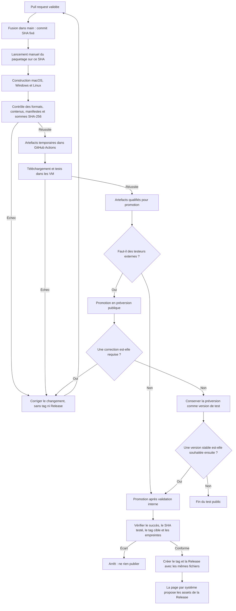
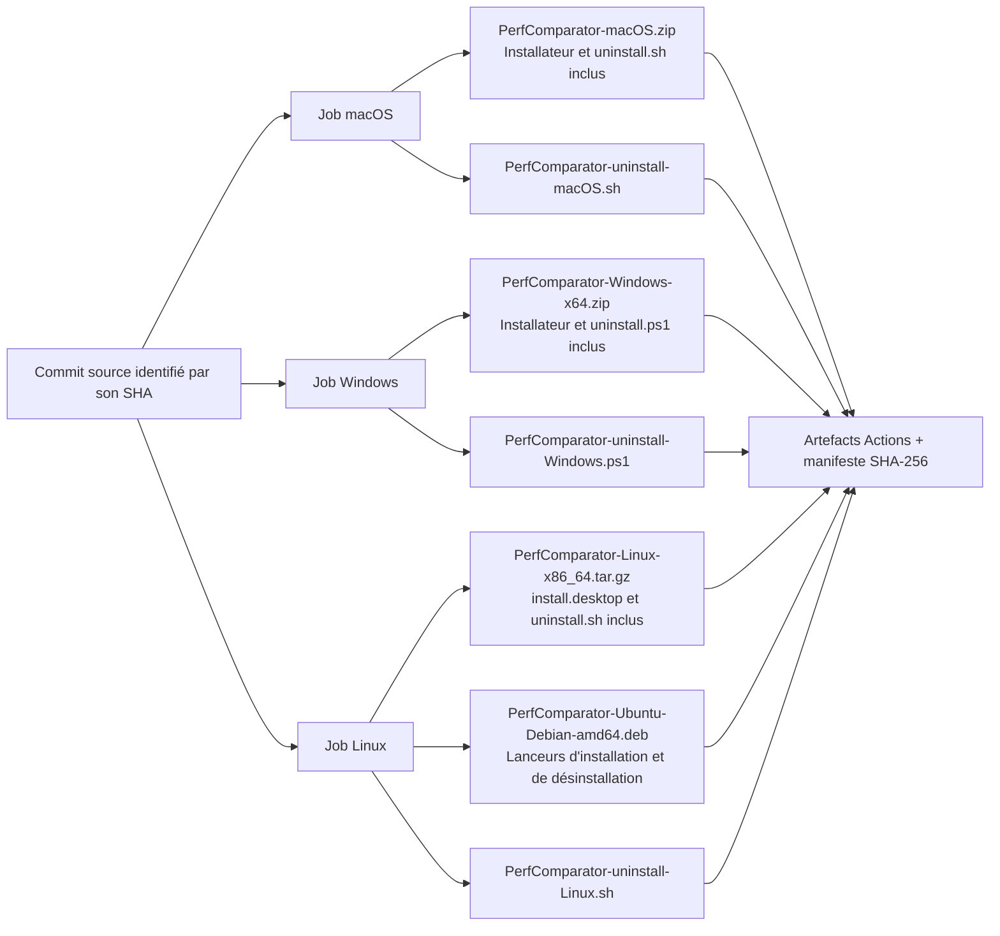
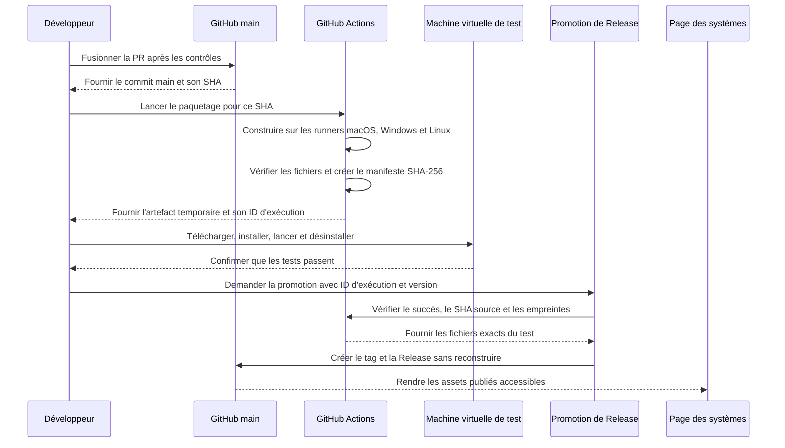
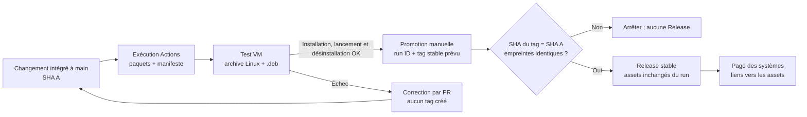
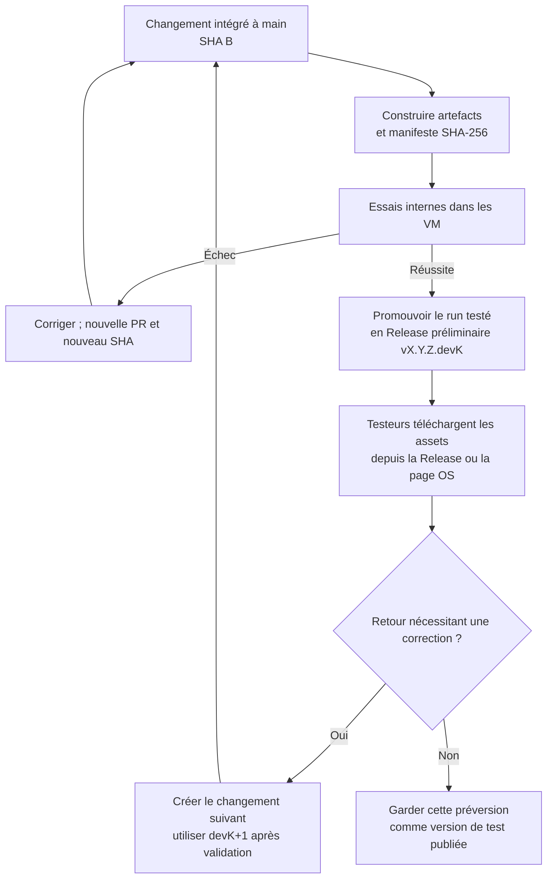

# Stratégie de publication

Cette fiche décrit comment une modification devient une version installable et
comment tester ses installateurs avant de publier une version.

## Les objets Git et GitHub

| Objet | Rôle | Peut-il changer de cible ? |
| --- | --- | --- |
| Branche de travail, par exemple `feat/nom` | Regroupe les commits d'une fonctionnalité en cours. | Oui, elle avance avec de nouveaux commits. |
| Branche de release, par exemple `release/0.4.0` | Porte le contenu final de la version et permet de l'intégrer par PR. | Oui, jusqu'à sa clôture. |
| Commit | Instantané précis de fichiers suivis. | Non : un nouveau contenu crée un nouveau commit. |
| Tag, par exemple `v0.4.0` | Désigne le commit exact d'une version publiée. | Il doit rester immuable après publication. |
| GitHub Release | Fiche publique, notes et archives associées à un tag. | Les notes peuvent être corrigées ; le tag et son code ne doivent pas être déplacés. |
| `main` | Branche par défaut, dont GitHub affiche le README sur la page d'accueil. | Elle avance par fusion de PR. |

Un fichier présent dans le dossier de travail mais non commité n'appartient à
aucun commit, tag ni release. Avant une publication, distinguer les changements
du produit et de sa documentation utilisateur des notes locales, fichiers
d'éditeur et mémoires de branche. Seuls les premiers doivent entrer dans le
périmètre de release.

## Tester les installateurs avant publication

Le paquetage doit pouvoir être testé sans créer de tag ni de GitHub Release.
Le parcours cible est le suivant :

1. Intégrer le changement à `main` après les contrôles habituels de la pull
   request. Cela fixe le commit exact à tester.
2. Lancer manuellement le workflow de paquetage sur ce commit de `main`. Le
   workflow construit les archives macOS, Windows et Linux, le paquet Ubuntu /
   Debian `.deb`, ainsi que les désinstallateurs autonomes. Il publie ces
   fichiers comme artefacts temporaires de l'exécution GitHub Actions, sans
   créer de tag ni de Release.
3. Télécharger ces artefacts depuis la page de l'exécution Actions et les tester
   dans les environnements cibles. Vérifier au minimum l'installation, le
   lancement de l'application et sa désinstallation ; sous Ubuntu / Debian,
   tester aussi le paquet `.deb`.
4. Si un test échoue, corriger le changement, l'intégrer, puis relancer le
   paquetage sur le nouveau commit. Ne créer aucune version publique à ce stade.
5. Après validation, publier la version en réutilisant les artefacts de
   l'exécution testée. Ne pas reconstruire les paquets au moment de la
   publication. Vérifier que le tag désigne le commit testé et que les sommes
   SHA-256 des fichiers publiés correspondent aux artefacts testés.

La promotion est une étape manuelle distincte du paquetage : elle reçoit l'ID
de l'exécution Actions validée et le tag demandé, vérifie que le commit de ce
tag est celui de l'artefact, télécharge les fichiers de cette exécution et les
joint à la Release. Elle ne reconstruit rien. En cas d'écart de commit, d'échec
ou de fichier absent, elle s'arrête sans publier.

L'exécution doit fournir une liste vérifiable de fichiers, et échouer si l'un
d'eux manque :

| Système | Artefacts à vérifier |
| --- | --- |
| macOS | `PerfComparator-macOS.zip`, `PerfComparator-uninstall-macOS.sh` |
| Windows | `PerfComparator-Windows-x64.zip`, `PerfComparator-uninstall-Windows.ps1` |
| Linux | `PerfComparator-Linux-x86_64.tar.gz`, `PerfComparator-Ubuntu-Debian-amd64.deb`, `PerfComparator-uninstall-Linux.sh` |

L'archive Linux doit contenir elle aussi `uninstall.sh` ; le `.deb` doit
installer le lanceur de désinstallation et son script. Les essais Actions
vérifient les formats et contenus de paquet ; ils ne remplacent pas le test
manuel des installateurs dans les VM.

Pour tester sans tag, chaque artefact doit identifier le SHA complet de son
commit source, et son installateur doit installer le code de ce même commit.
Les scripts actuels utilisent par défaut un tag GitHub ; le mode de prévisualisation
devra donc leur fournir explicitement la source du commit testé. C'est une
condition de validité du test, pas une option : un paquet de branche qui
installerait silencieusement une ancienne version publiée n'est pas un artefact
de test acceptable.

Dans GitHub, les artefacts de test se récupèrent depuis **Actions → exécution
du commit → Artifacts**. Leur nom et un manifeste doivent indiquer le SHA source ;
la durée de conservation doit rester temporaire et être configurée dans le
workflow.

Les artefacts Actions servent aux essais internes et temporaires. Une
préversion GitHub reste facultative : elle n'est créée que si les fichiers
doivent être accessibles publiquement aux testeurs. Dans les deux cas, le test
précède la publication stable et porte sur les mêmes fichiers qui seront
distribués.

**État actuel :** `package-installers.yml` construit les artefacts à la demande
sur `main` et les conserve temporairement avec un manifeste SHA-256.
`promote-tested-release.yml` reçoit l'identifiant de cette exécution et un tag
déjà poussé. Il vérifie la réussite du run, le commit exact du tag, la version
du manifeste, la présence des sept fichiers et leurs empreintes, puis crée la
Release avec ces mêmes fichiers, sans reconstruction. Un contrôle incohérent
fait échouer la promotion avant toute création de Release.

## Schémas du parcours de publication

Les schémas ci-dessous illustrent les étapes manuelles, automatisations et
contrôles du parcours de publication.

### Parcours, validations et décisions

### Artefacts produits et couverts par les tests

### Séquence de construction, test et promotion

## Exemples de parcours

Les noms de versions et les SHA ci-dessous sont des variables d'exemple, pas des
versions réservées ni des autorisations de publication.

### Exemple 1 — tester en interne, puis publier une stable sans préversion

Dans cet exemple, la VM utilise l'archive Linux pour les distributions générales
et le `.deb` pour Ubuntu / Debian. La publication stable réutilise les fichiers
de ce run ; elle ne déclenche pas une seconde construction.

### Exemple 2 — publier une préversion pour des testeurs externes

Une préversion publiée reste une préversion : elle ne devient pas stable en
renommant son tag. Si une stable est ensuite souhaitée, préparer et tester sa
version selon l'exemple 1. Les deux parcours n'ont pas besoin d'être exécutés
pour chaque changement ; choisir le premier par défaut et le second seulement
si un accès public aux testeurs est utile.

## Déroulé d'une stable

1. **Fixer le périmètre.** Inventorier le diff et le statut Git. Vérifier que
   chaque changement produit attendu est suivi et commité ; laisser explicitement
   de côté les rapports privés, sorties générées, réglages locaux et notes
   transitoires.
2. **Préparer la version.** Depuis les changements fonctionnels validés, aligner
   la version du paquet, les installateurs, le verrou de dépendances, les tests,
   le README et la documentation. Les installateurs doivent cibler le commit
   source testé ; le tag publié désignera ce même commit.
3. **Construire et tester les installateurs.** Suivre le parcours décrit plus
   haut : exécuter les validations adaptées, inspecter les paquets et tester
   dans les VM les artefacts issus du commit intégré. Ne pas refaire une
   validation probante sans changement pertinent.
4. **Publier la référence et les artefacts testés.** Après annonce précise et
   confirmation explicite, créer le tag annoté sur le commit vérifié et publier
   la Release avec les mêmes fichiers que ceux testés. Le commit doit déjà être
   accessible sur une branche distante.
5. **Vérifier la clôture.** Contrôler le SHA du tag, les assets et leurs sommes,
   la fiche Release, l'état de la PR et le contenu distant de `main`, notamment
   le README et ses liens. Le travail n'est terminé qu'une fois l'intégration
   vérifiée.

Ne jamais remplacer un asset, déplacer un tag ou publier une nouvelle version
pour masquer un test échoué. Si un contrôle échoue ou qu'un état distant diffère
de celui annoncé, arrêter la séquence et réévaluer avant toute autre écriture.
Une confirmation explicite peut couvrir une séquence annoncée en entier, mais
n'autorise pas à en élargir le périmètre.

## Tester les installateurs avant publication

Pour tester les installateurs sans publier de tag ou de Release, intégrer
d'abord les changements dans `main`, puis lancer **Actions → Package desktop
installers → Run workflow** en choisissant `main`. Le workflow produit les
archives macOS, Windows et Linux, le paquet Ubuntu / Debian `.deb` et les
désinstallateurs autonomes sous la forme d'un artefact Actions temporaire
(conservation de 14 jours).

Chaque paquet contient le SHA complet de son commit source et une URL d'archive
GitHub épinglée sur ce SHA ; son installateur utilise cette URL plutôt qu'une
version antérieure par tag. L'artefact global inclut un manifeste indiquant le
SHA source, la version du paquet et les empreintes SHA-256 des fichiers. Vérifier
ce manifeste, puis tester exactement ces fichiers dans les VM et sur le Mac.
Ne pas créer de préversion ou de Release pour ce parcours interne.

La promotion d'un artefact Actions déjà testé vers une Release n'est pas encore
automatisée. Le workflow déclenché par une Release reconstruit les paquets ; ne
pas l'utiliser pour publier les résultats des essais tant que la promotion des
mêmes fichiers n'est pas disponible.

## Préversions

Les préversions utilisent la forme `vX.Y.Z.devK`, par exemple `v0.4.0.dev7` ;
la version du paquet est identique sans le `v`. README, installateurs,
documentation et liens doivent employer exactement la même version. Les
préversions ne remplacent pas la stable recommandée.

## Exemple : `v0.4.0`

- Le tag annoté `v0.4.0` désigne le commit de release `cabeb2f`.
- La GitHub Release **PerfComparator v0.4.0** est associée à ce tag.
- La PR #23 a intégré ce commit à `main` dans le commit de fusion `ba962a0`.
- Le tag n'a pas été déplacé sur le commit de fusion : celui-ci contient le
  commit tagué comme parent, et le README de `main` annonce désormais la stable.

Cette distinction permet de retrouver le commit exact de la version publiée
tout en gardant une intégration documentée dans la branche par défaut.
